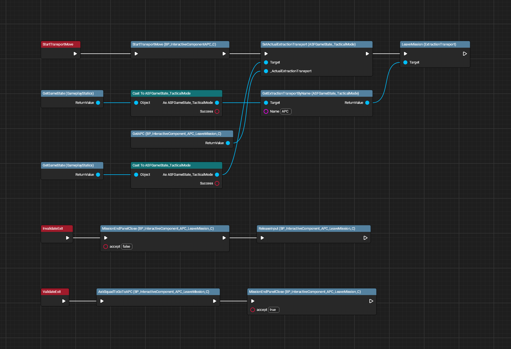
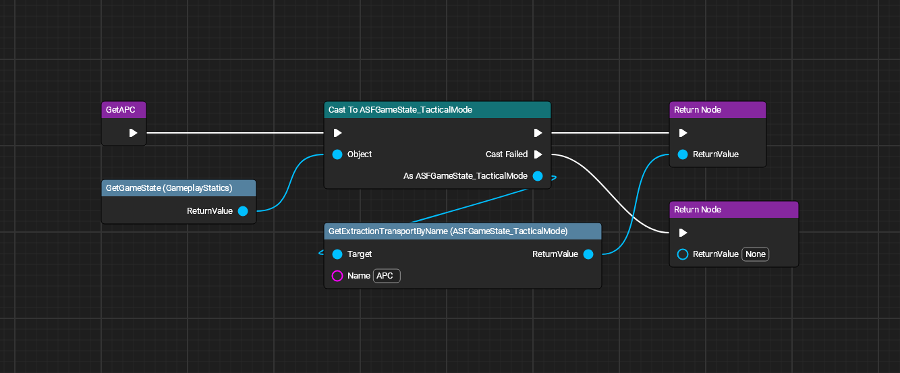
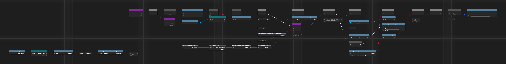
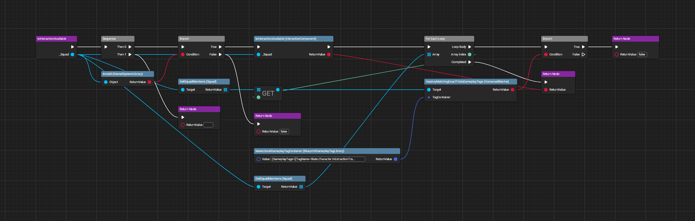
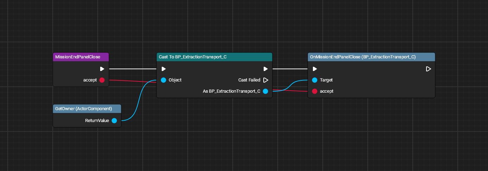

# APC Interactions (Leave Mission)

All images made with [UE Blueprint Graph Viewer](https://github.com/glgen/UEBlueprintGraphViewer/releases).

## File Location
`/Game/Blueprint/TacticalMode/Interaction/APC/P_InteractiveComponent_APC_LeaveMission`

## Ubergraph

## Functions

### Block Input

### Get APC

### Is Interaction Allowed

### Is Interaction Available

### Mission End Panel Close

### Release Input
