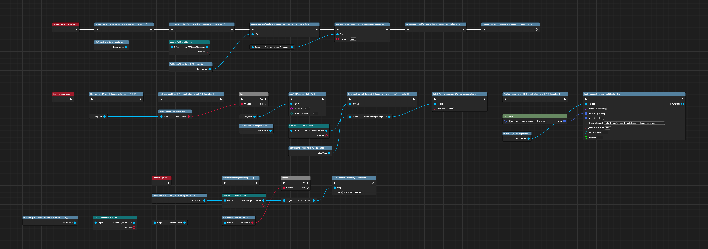
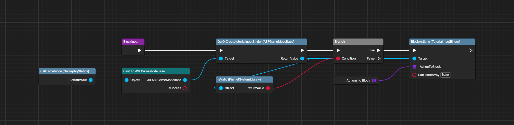
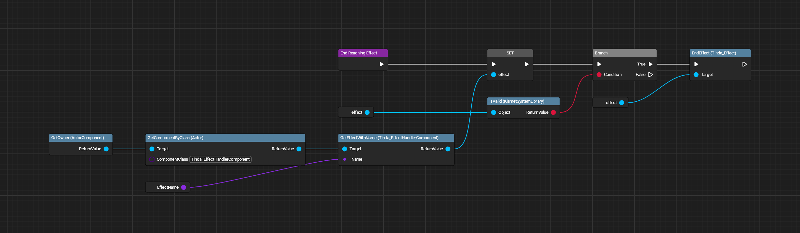
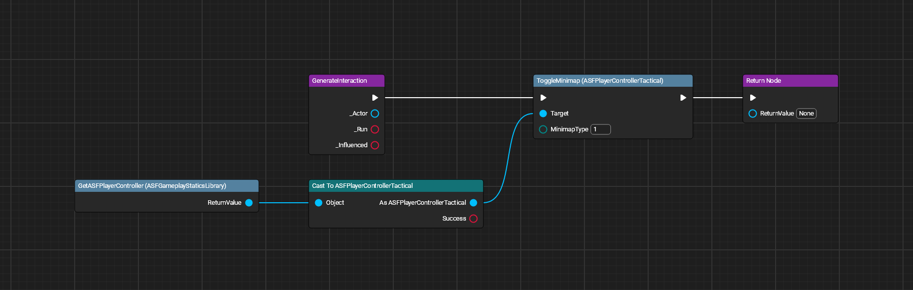
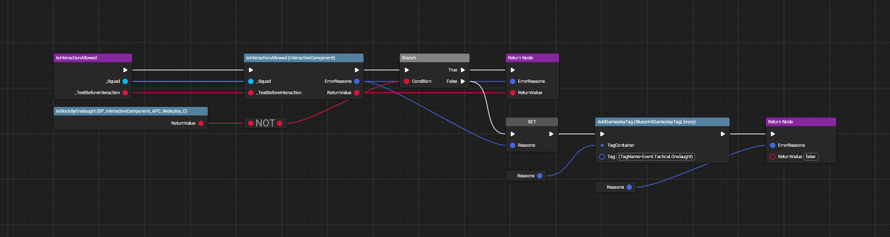
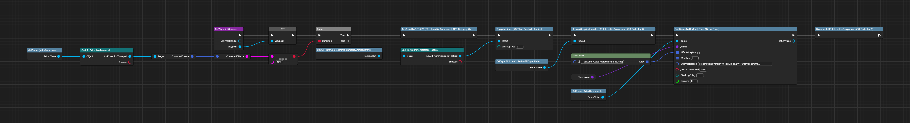
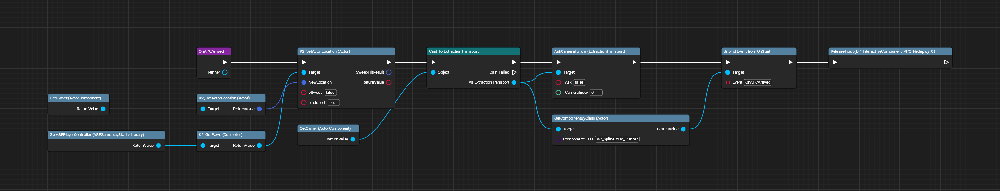
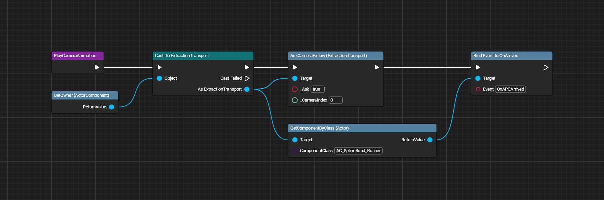
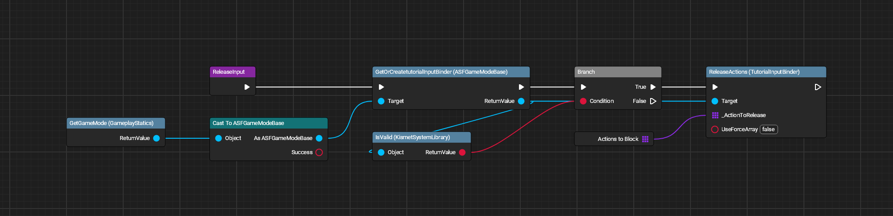
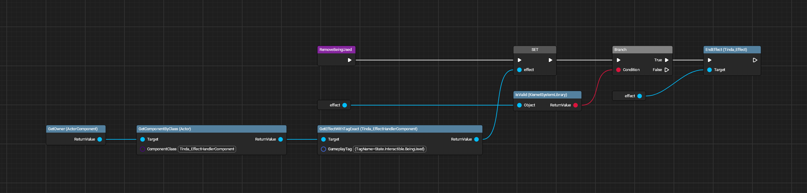

# APC Interactions (Reploy)

All images made with [UE Blueprint Graph Viewer](https://github.com/glgen/UEBlueprintGraphViewer/releases).

## File Location
`/Game/Blueprint/TacticalMode/Interaction/APC/P_InteractiveComponent_APC_Reploy`

## Ubergraph

## Functions

### Block Input

### End Reaching Effect

### Generate Interaction

### Is Interaction Allowed

### On Waypoint Selected

### On APC Arrived

### Play Camera Animation

### Release Input

### Remove Being Used
