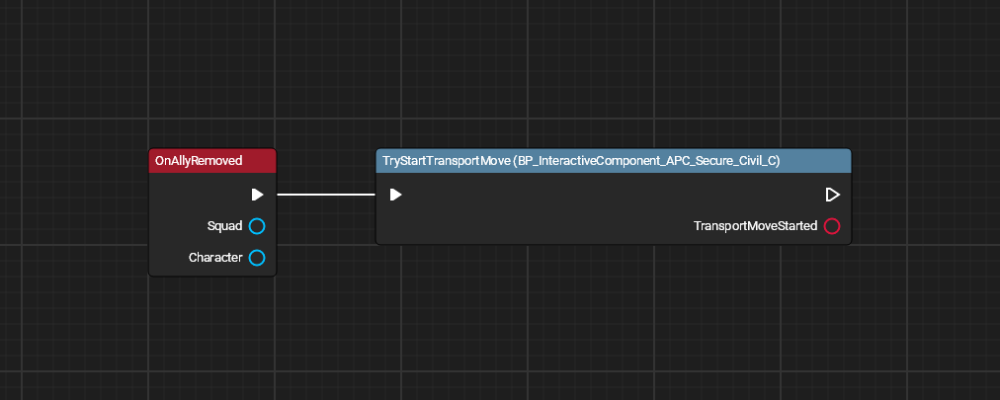
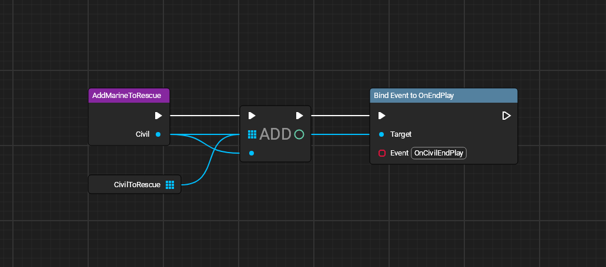
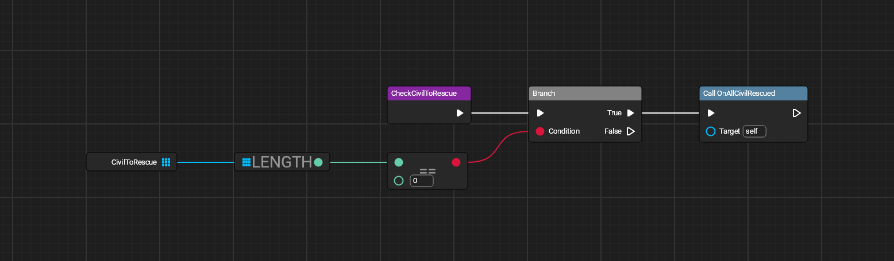
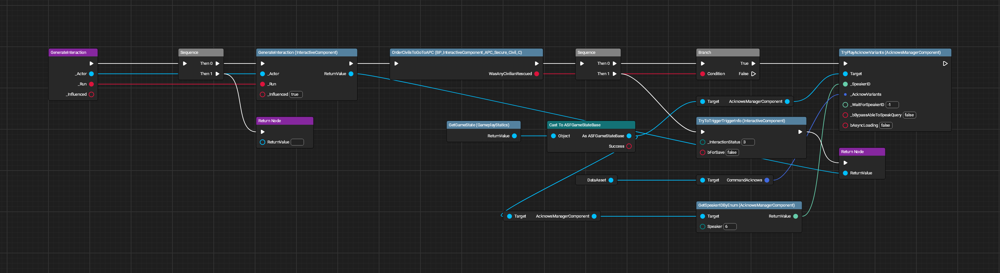
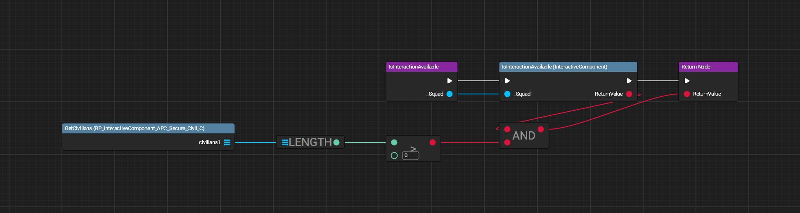
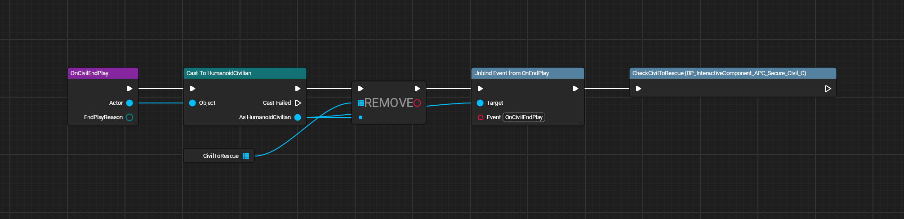
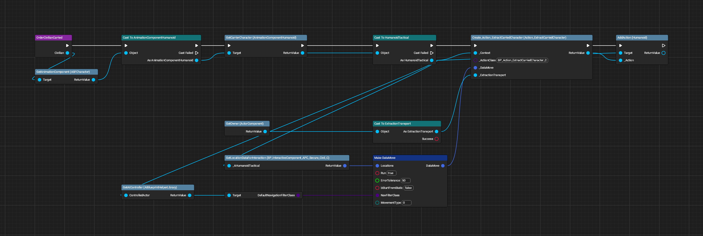
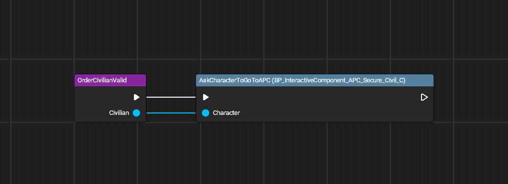
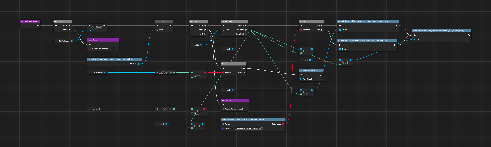

# APC Interactions (Secure Civilians)

All images made with [UE Blueprint Graph Viewer](https://github.com/glgen/UEBlueprintGraphViewer/releases).

## File Location
`/Game/Blueprint/TacticalMode/Interaction/APC/P_InteractiveComponent_APC_Secure_Civil`

## Ubergraph

## Functions

### Add Marine to Rescue

### Check Civilian to Rescue

### Generate Interaction

### Generate Interaction

### Is Interaction Available

### On Civilian End Play

### Order Civilian Carried

### Order Civilian Valid

### Order Civilians to Go to APC
