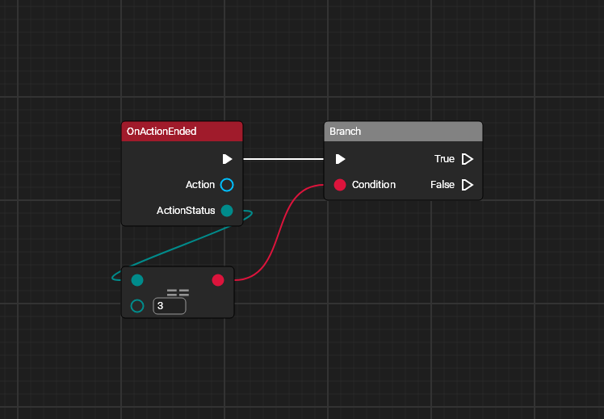
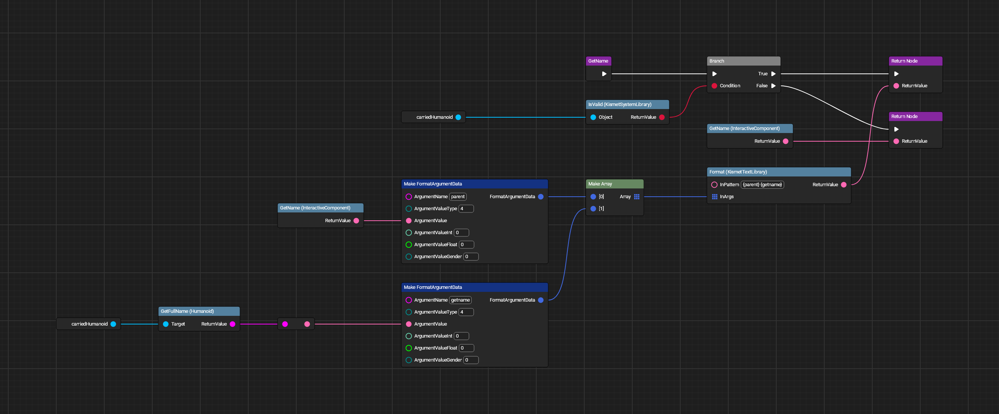
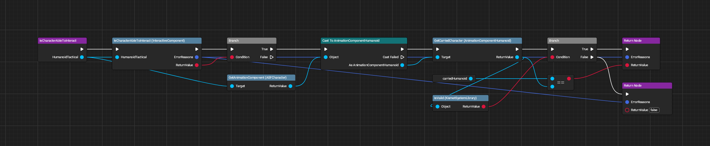
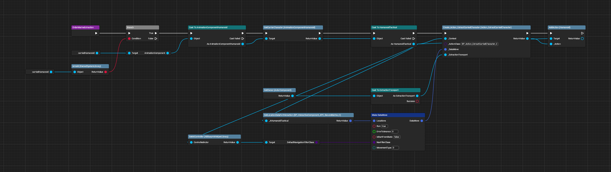

# APC Interactions (Secure Marines)

All images made with [UE Blueprint Graph Viewer](https://github.com/glgen/UEBlueprintGraphViewer/releases).

## File Location
`/Game/Blueprint/TacticalMode/Interaction/APC/P_InteractiveComponent_APC_SecureMarine`

## Ubergraph

## Functions

### Generate Interaction

### Get Name

### Is Character Able to Interact

### Order Marine Extraction
