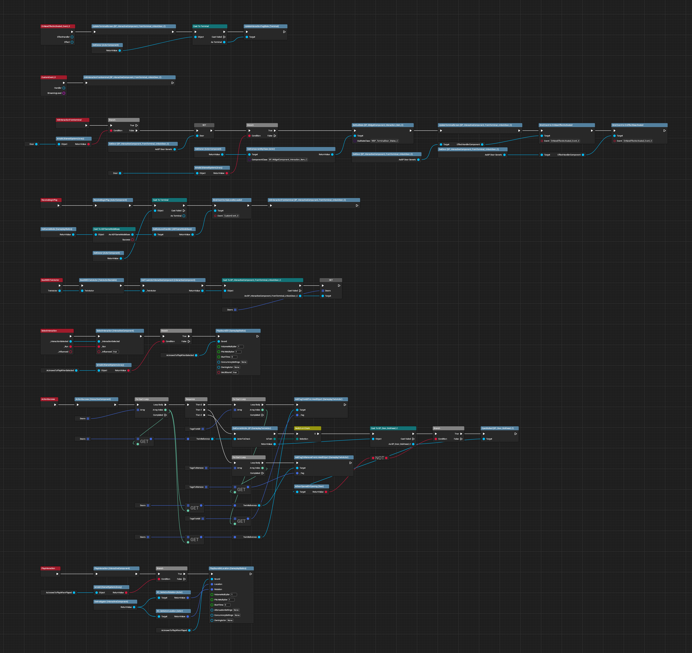
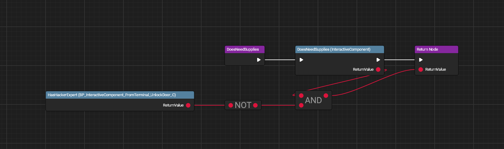
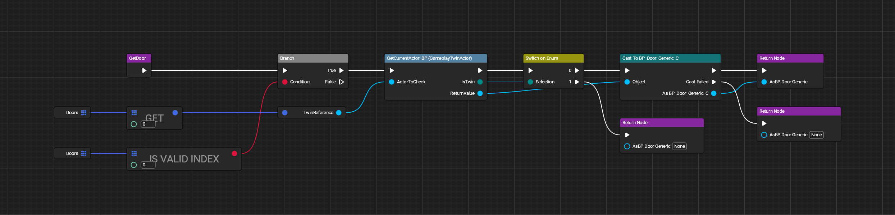
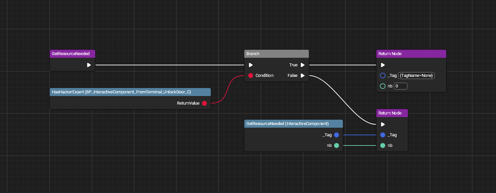
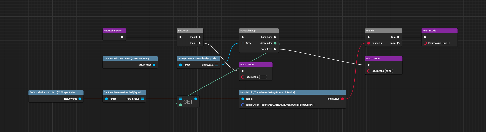
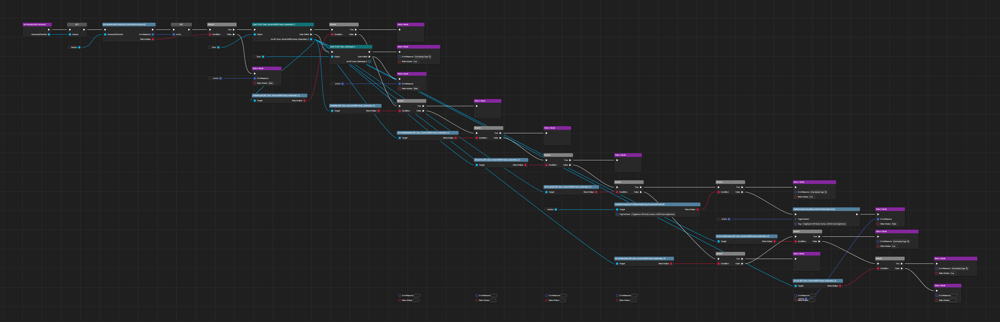
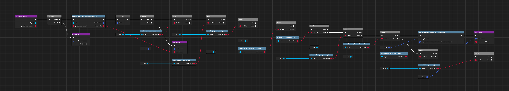
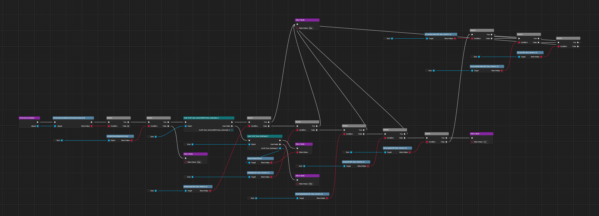
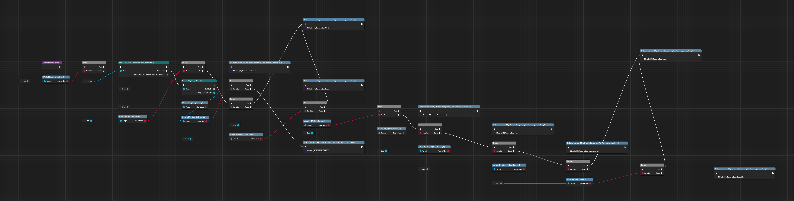

# Hacking Doors From Terminal

A partial capture of the Blueprint code controlling door hacking.

Variables and many types of functions are not fully reverse engineerable from these images, but they do show how the code works.

Missing functions have local variables that aren't parseable at the moment.

All images made with [UE Blueprint Graph Viewer](https://github.com/glgen/UEBlueprintGraphViewer/releases).

## File Location
`/Game/Blueprint/TacticalMode/Interaction/Terminal/BP_InteractiveComponent_FromTerminal`

## Ubergraph

## Functions
Several of these are based on Override functions that can be selected in the SDK.

### Does Need Supplies

### Get Door

### Get Resource Needed

### Has Hacker Expert

### Is Character Able to Interact

### Is Interaction Allowed

### Is Interaction Available

### Update Terminal Screen
