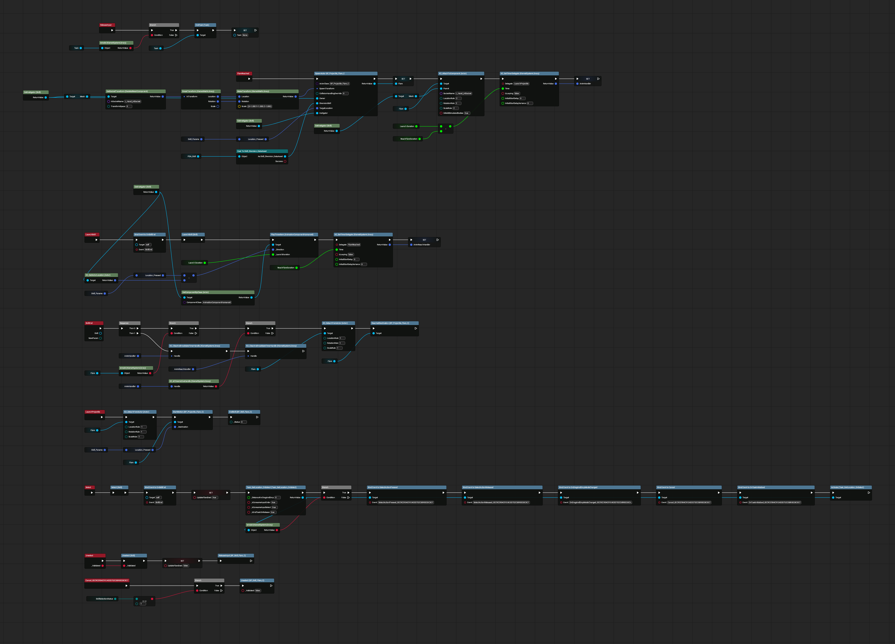
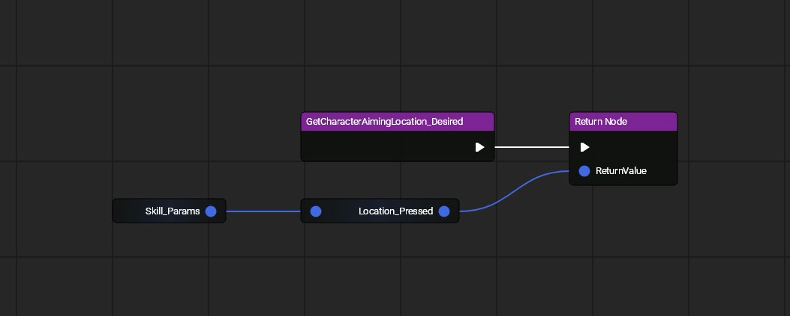
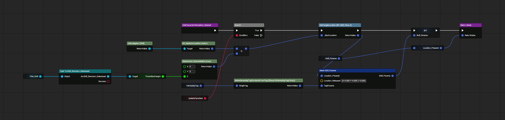
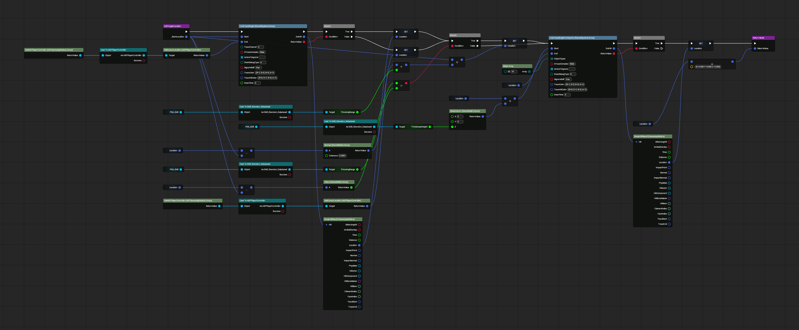

# Flare Interactions

All images made with [UE Blueprint Graph Viewer](https://github.com/glgen/UEBlueprintGraphViewer/releases).

## File Location
`/Game/Blueprint/TacticalMode/Skill/BP_Skill_Flare`

## Ubergraph

## Functions

### Get Character Aiming Location Desired Properties

### Get Character Orientation Desired Properties

### Get Target Location Desired Properties
