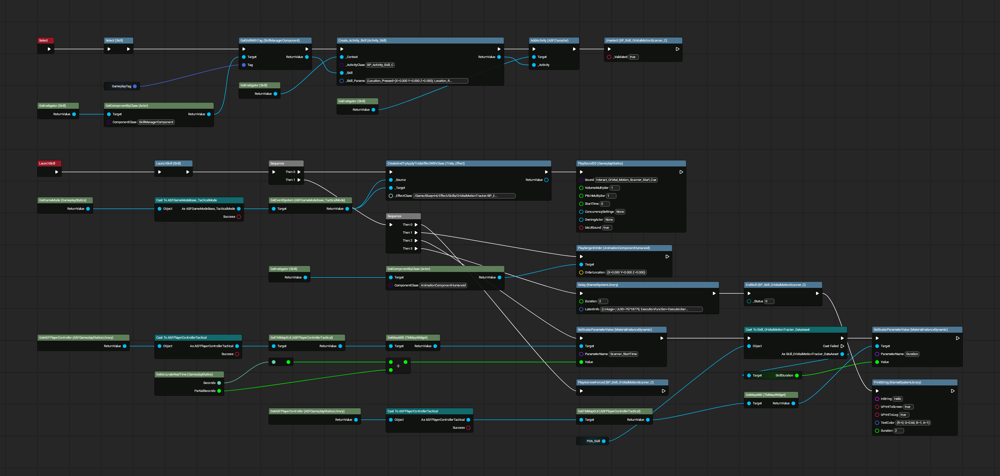
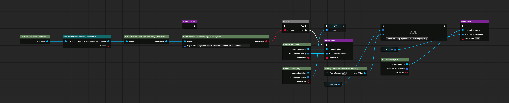
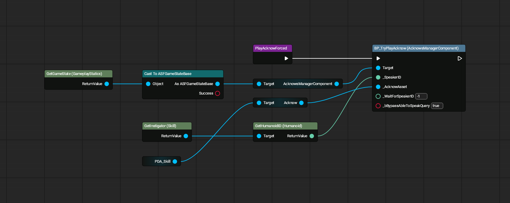

# Orbital Motion Tracker Interactions

All images made with [UE Blueprint Graph Viewer](https://github.com/glgen/UEBlueprintGraphViewer/releases).

## File Location
`/Game/Blueprint/TacticalMode/Skill/BP_Skill_OrbitalMotionScanner`

## Ubergraph

## Functions

### Can Be Launched Properties

### Play Acknow Forced Properties

