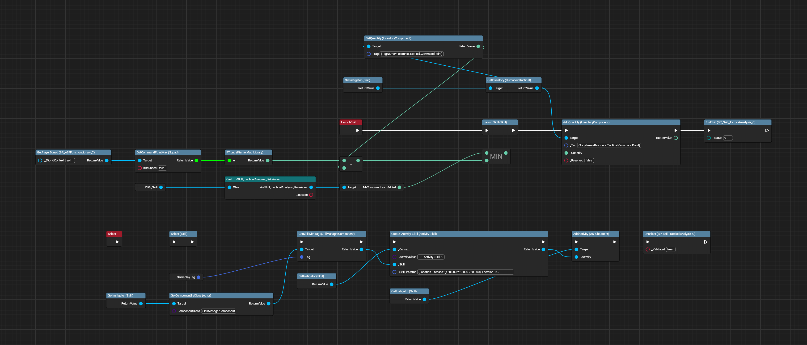
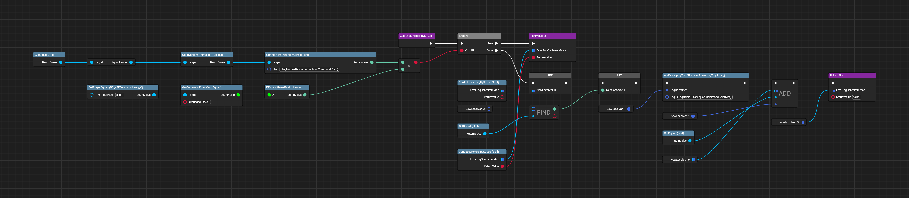

# Tactical Analysis Interactions

All images made with [UE Blueprint Graph Viewer](https://github.com/glgen/UEBlueprintGraphViewer/releases).

## File Location
`/Game/Blueprint/TacticalMode/Skill/BP_Skill_TacticalAnalysis`

## Ubergraph

## Functions

### Can Be Launched By Squad Properties
