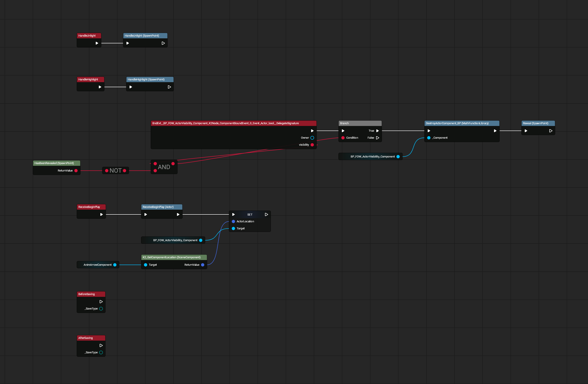
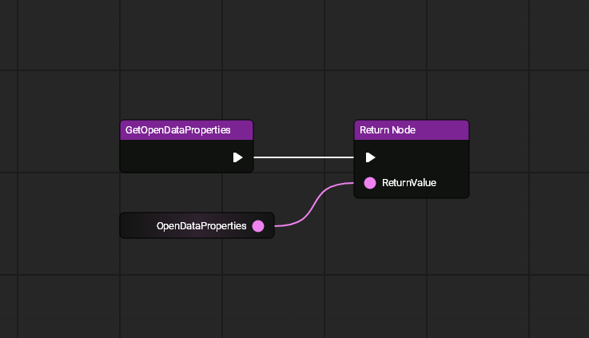
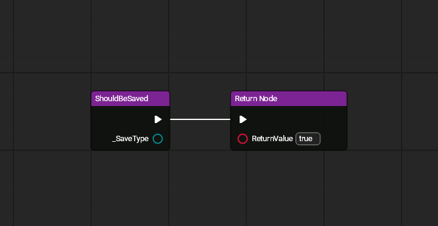
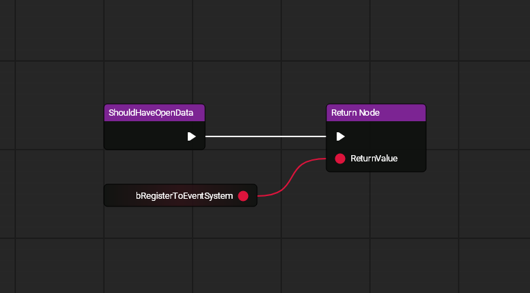
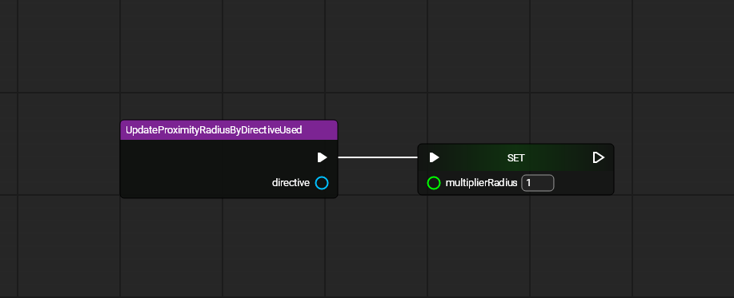
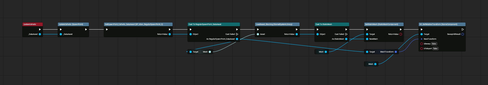

# Regular Spawn Points

All images made with [UE Blueprint Graph Viewer](https://github.com/glgen/UEBlueprintGraphViewer/releases).

## File Location
`/Game/Blueprint/TacticalMode/SpawnPoints/BP_RegularSpawnPoint`

## Ubergraph

## Functions

### Get Open Data Properties

### Should Be Saved

### Should Have Open Data

### Update Proximity Radius by Directive Used

----

## File Location
`/Game/Blueprint/TacticalMode/SpawnPoints/Alien/BP_Alien_RegularSpawnPoint_Ubergraph`

## Ubergraph
