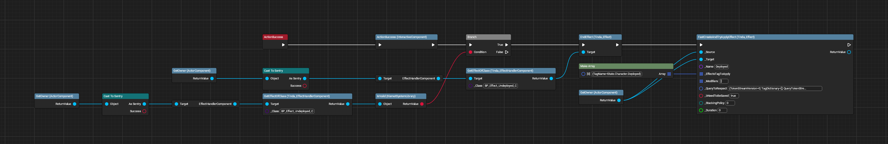
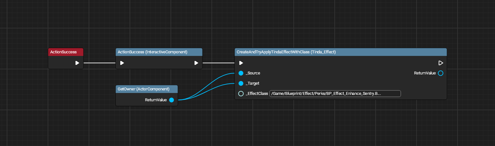
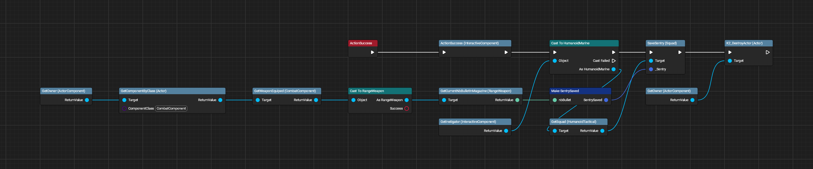
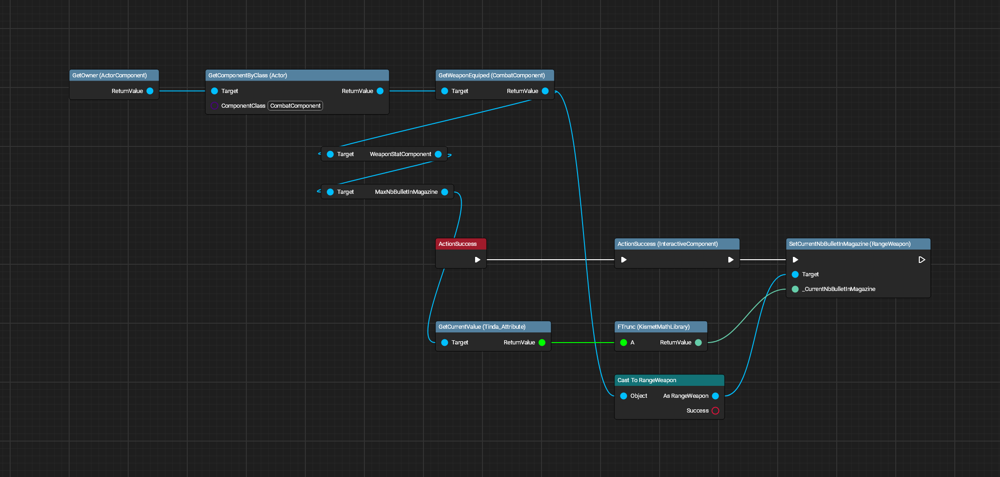
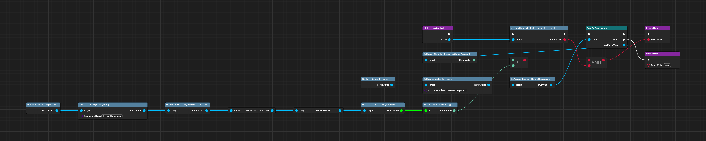

# Sentry Interactions

All images made with [UE Blueprint Graph Viewer](https://github.com/glgen/UEBlueprintGraphViewer/releases).

## File Location
`/Game/Blueprint/TacticalMode/Character/Ally/Sentry/SentryInteraction/BP_InteractiveComponent_Sentry_Activate`

## Ubergraph

---

## File Location
`/Game/Blueprint/TacticalMode/Character/Ally/Sentry/SentryInteraction/BP_InteractiveComponent_Sentry_Enhance`

## Ubergraph

---

## File Location
`/Game/Blueprint/TacticalMode/Character/Ally/Sentry/SentryInteraction/BP_InteractiveComponent_Sentry_Pickup`

## Ubergraph

---

## File Location
`/Game/Blueprint/TacticalMode/Character/Ally/Sentry/SentryInteraction/BP_InteractiveComponent_Sentry_Reload`

## Ubergraph

## Functions

### Is Interaction Available
