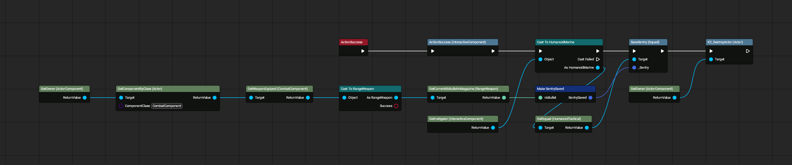
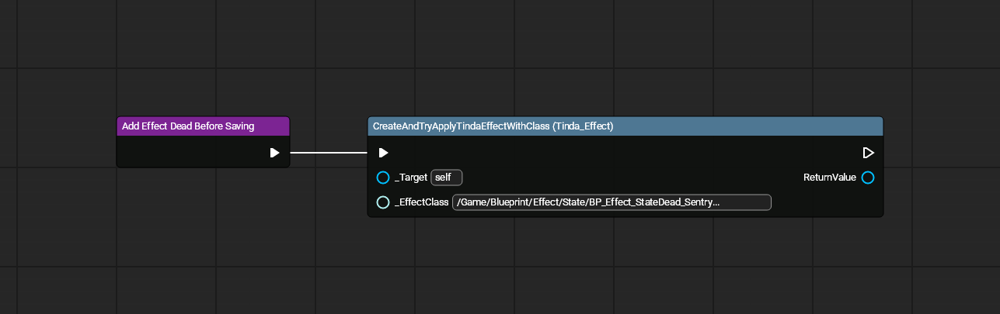
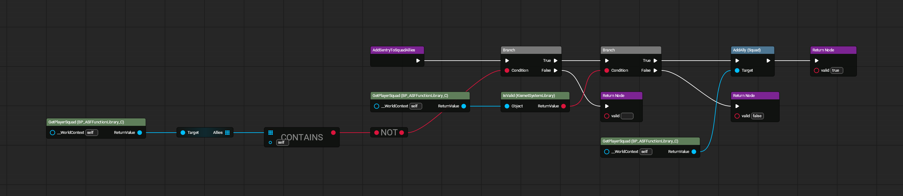
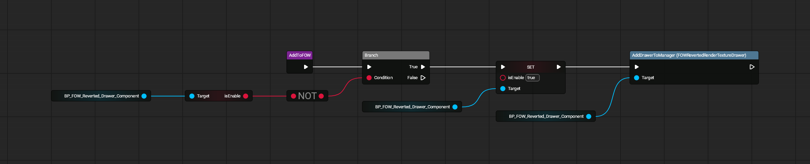
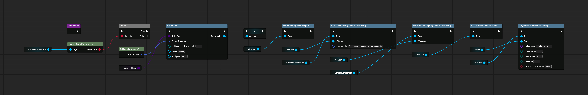
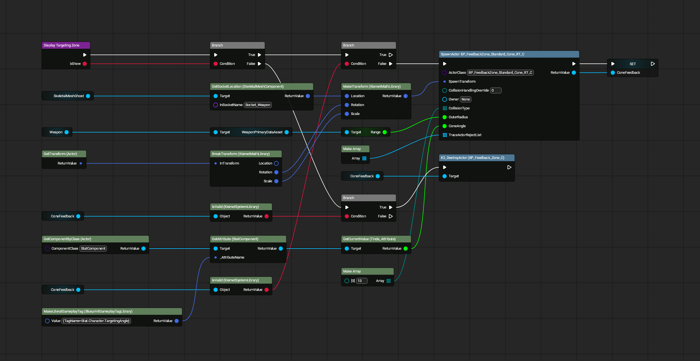
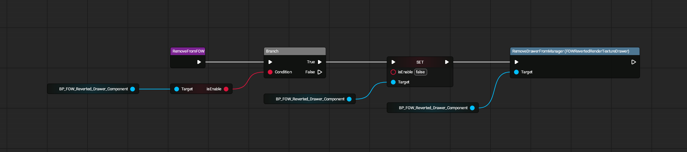

# Sentry Ally

All images made with [UE Blueprint Graph Viewer](https://github.com/glgen/UEBlueprintGraphViewer/releases).

## File Location
`/Game/Blueprint/TacticalMode/Character/Ally/Sentry/SentryInteraction/BP_InteractiveComponent_Sentry_Activate`

## Ubergraph

## Functions

### Add Effect Dead Before Saving

### Add Sentry to Squad Allies

### Add to FOW

### Add Weapon

### Display Targeting Zone

### Remove From FOW
