# Shoot the Test

**NOTE:** The purpose of this blueprint is not entirely clear.

All images made with [UE Blueprint Graph Viewer](https://github.com/glgen/UEBlueprintGraphViewer/releases).

## File Location
`/Game/Blueprint/TacticalMode/Interaction/Enemy/P_InteractiveComponent_ShootTheTest`

## Ubergraph
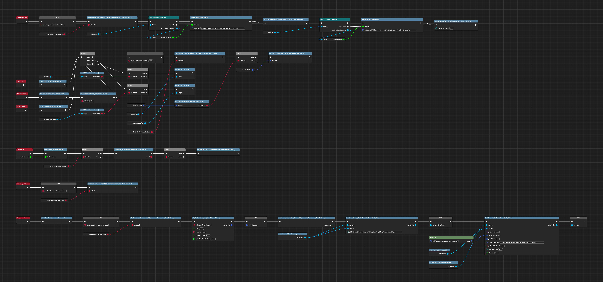

## Functions

### Is Interaction Allowed
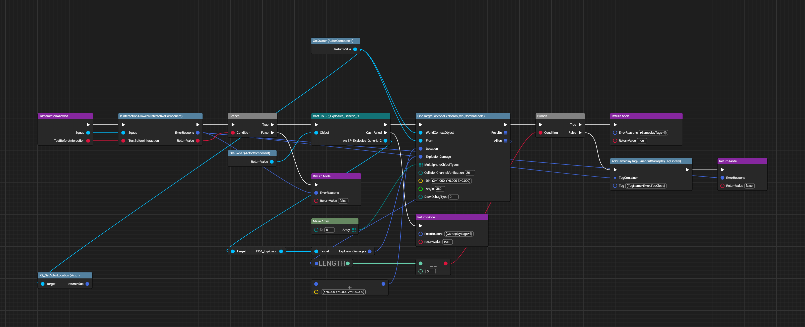

### Add Bullet in Magazine if Needed
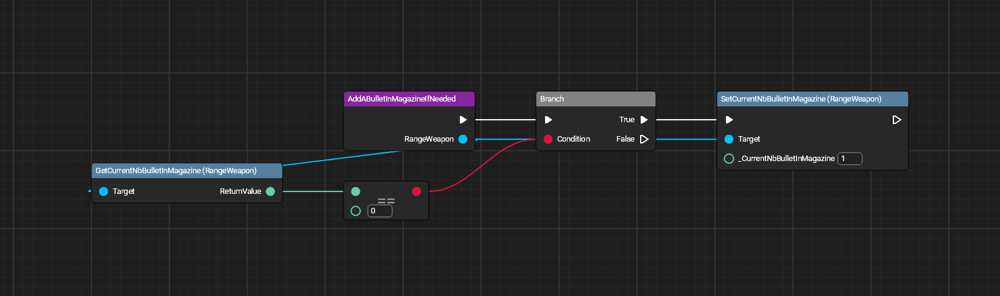

### Character Can Target the Target
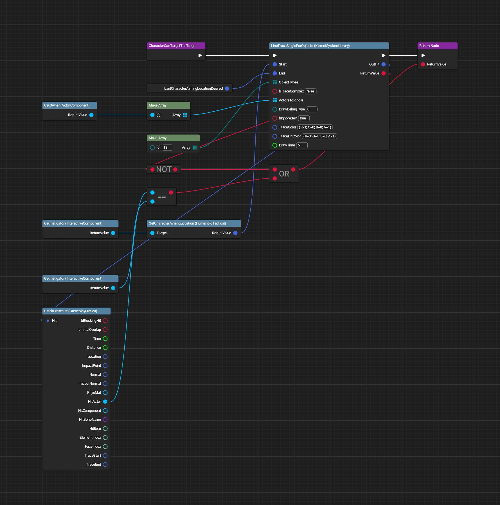

### Character Has Angle to Target
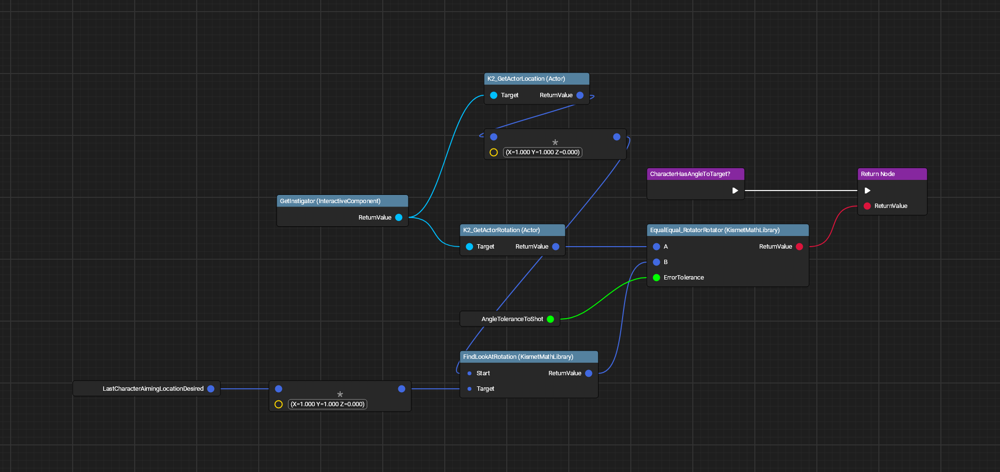

### Character Is In Aiming State
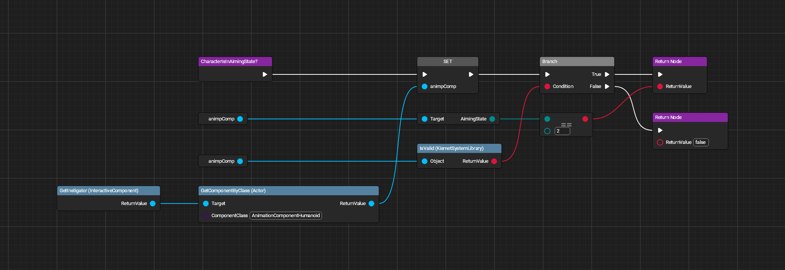

### Do Checks
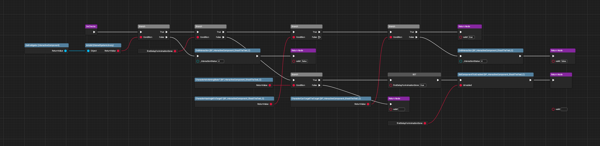

### Do Damage Internal
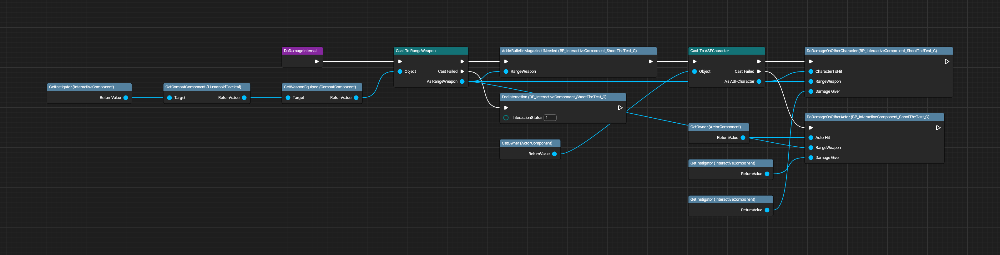

### Do Damage on Other Actor
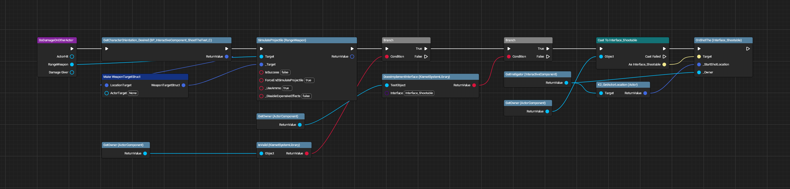

### Do Damage on Other Character
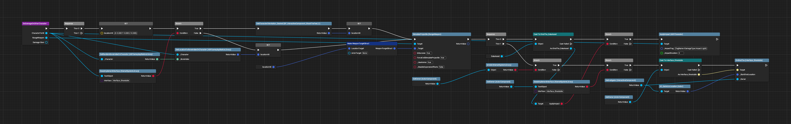

### Get Best Marine For Interaction
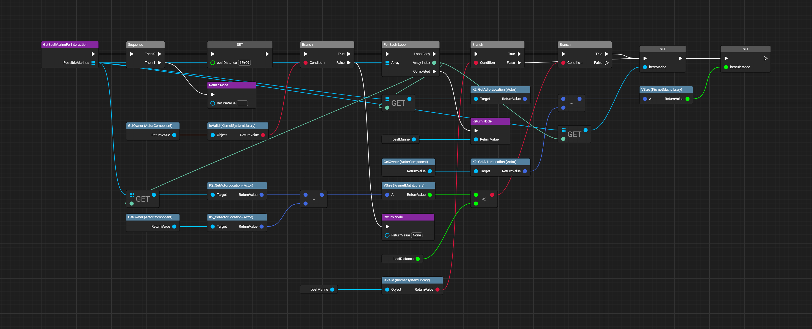

### Get Character Orientation Desired
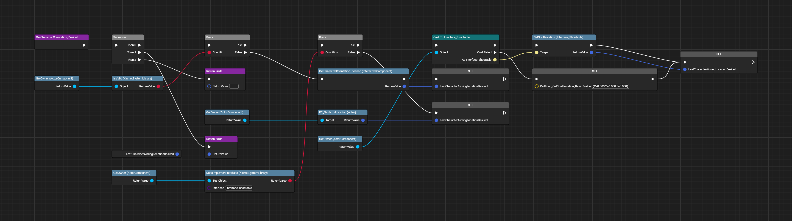

### Get Owner Location to Raycast Available
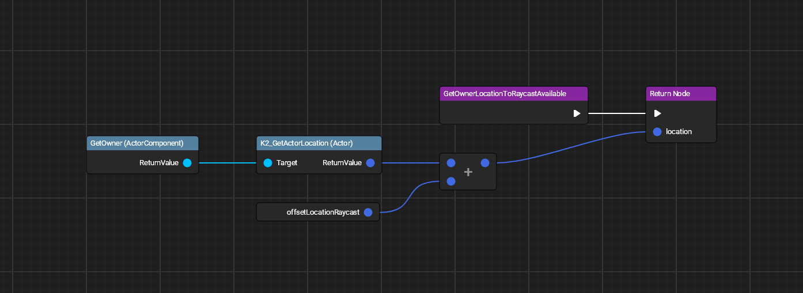

### Get Swap Activity
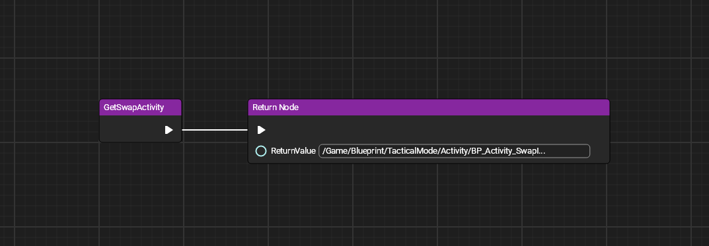

### Is Character Able to Interact
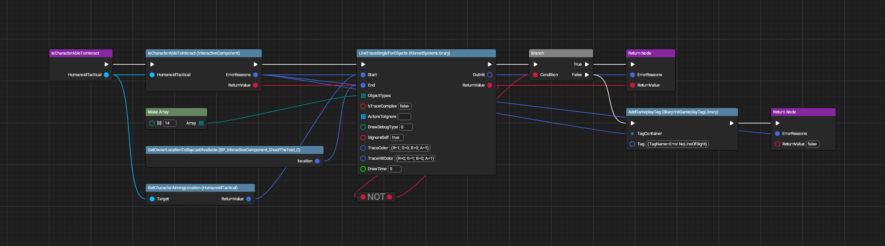