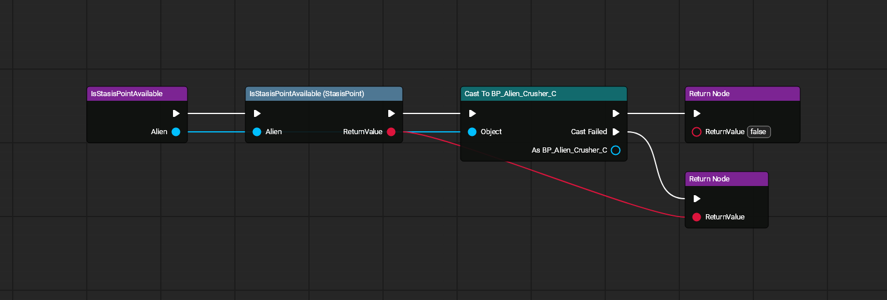
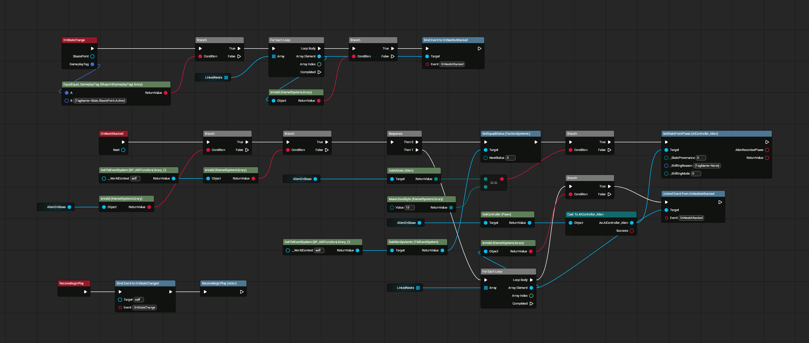
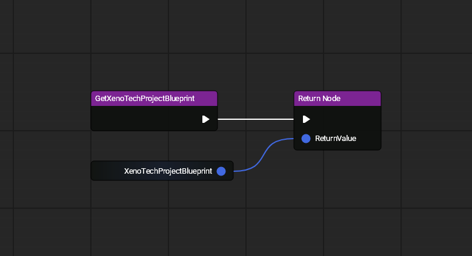
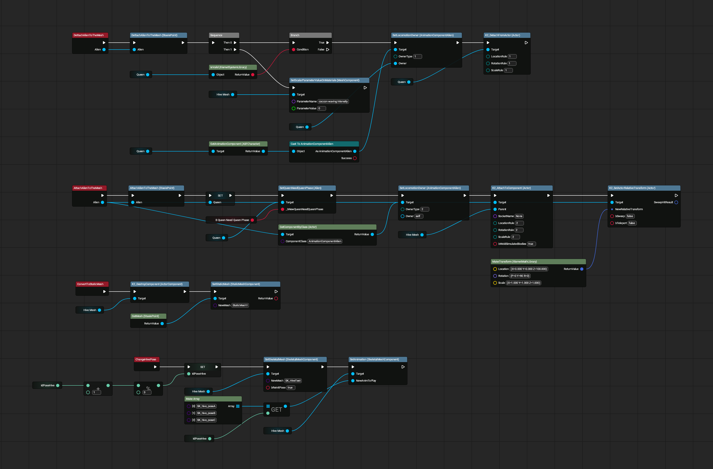

# Stasis Points

All images made with [UE Blueprint Graph Viewer](https://github.com/glgen/UEBlueprintGraphViewer/releases).

## File Location
`/Game/Blueprint/TacticalMode/StasisPoint/BP_StasisPoint`

## Functions

### Is Stasis Point Available

----

## File Location
`/Game/Blueprint/TacticalMode/StasisPoint/BP_StasisPoint_Queen`

## Ubergraph

## Functions

### Get XenoTech Project

----

## File Location
`/Game/Blueprint/TacticalMode/StasisPoint/BP_StasisPoint_Queen_Nest`

## Ubergraph
