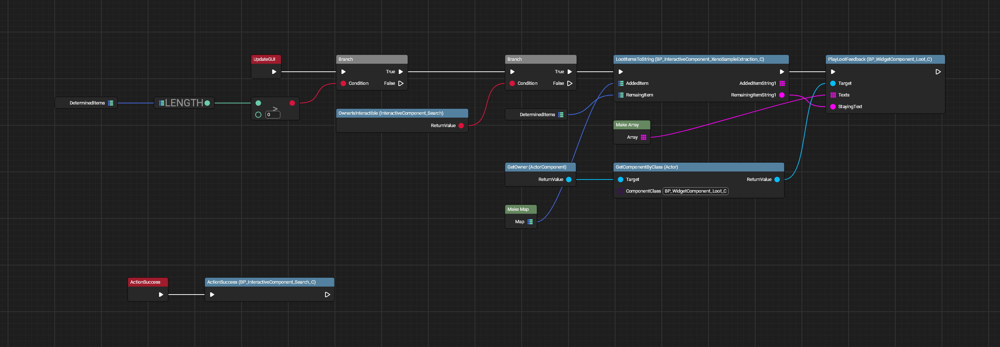
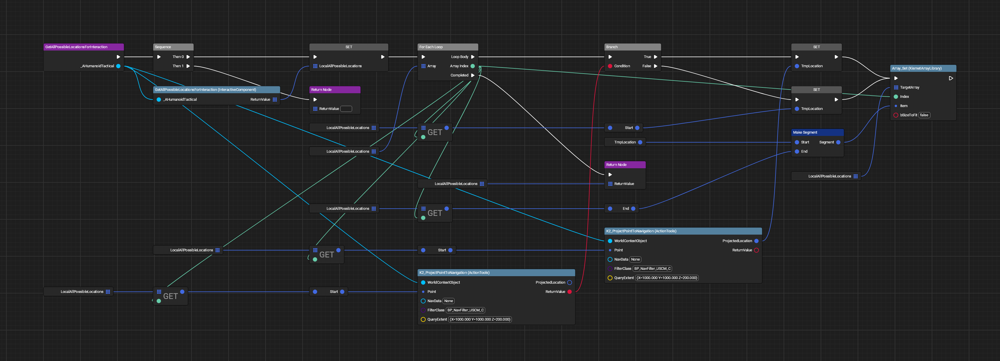

# Xenosample Extraction

All images made with [UE Blueprint Graph Viewer](https://github.com/glgen/UEBlueprintGraphViewer/releases).

## File Location
`/Game/Blueprint/TacticalMode/Interaction/Enemy/XenoSampleExtraction`

## Ubergraph

## Functions

### Get All Possible Locations For Interaction
